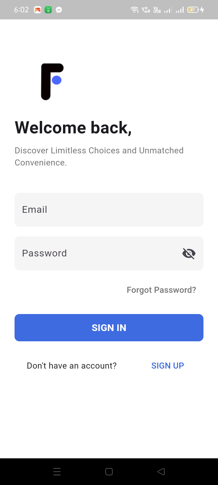
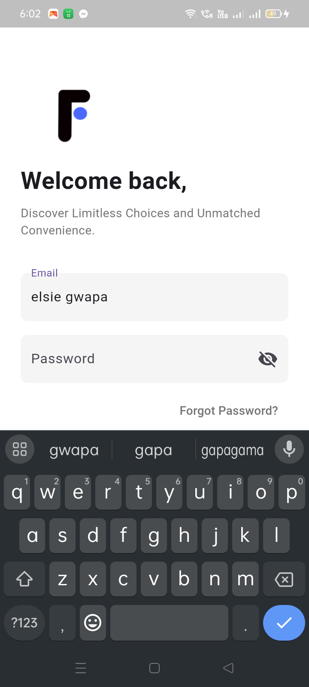
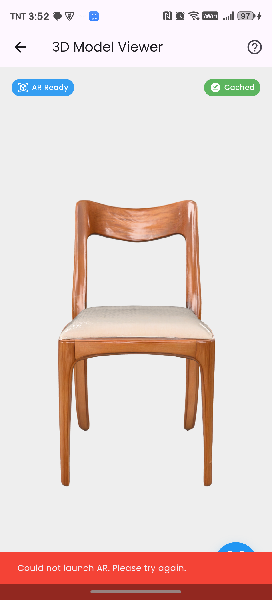
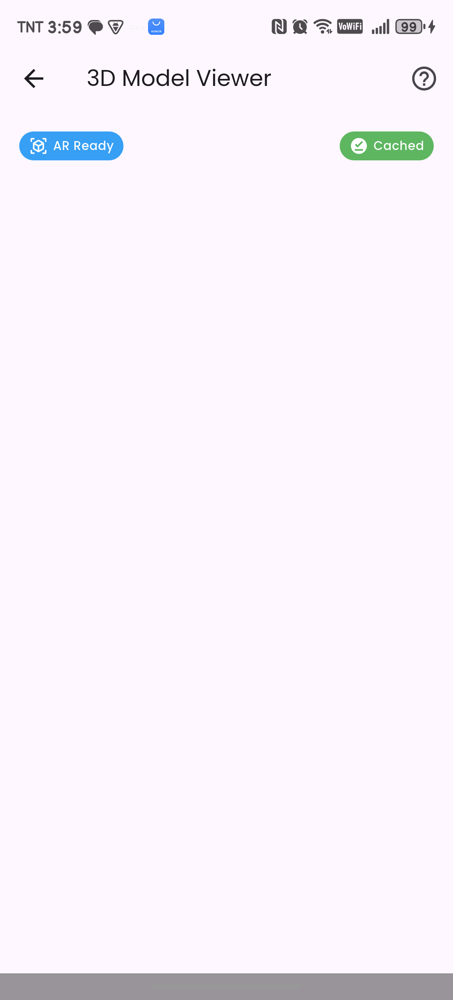

# 🛋️ FurniStore

A modern e-commerce Flutter application for furniture shopping with augmented reality features, seller management, and comprehensive analytics.

[](https://flutter.dev/)
[](https://firebase.google.com/)
[]()

## 📋 Table of Contents

- [Features](#features)
- [Technology Stack](#technology-stack)
- [Project Structure](#project-structure)
- [Installation](#installation)
- [Configuration](#configuration)
- [Usage](#usage)
- [Screenshots](#screenshots)
- [API Integration](#api-integration)
- [Contributing](#contributing)
- [License](#license)

## ✨ Features

### 👥 User Features

#### 🛒 Shopping Experience
- Browse furniture by categories (Beds, Chairs, Tables, Sofas, Lamps)
- Advanced product search and filtering
- Product details with high-quality images
- Add to cart and wishlist functionality
- Real-time stock availability
- Product reviews and ratings (5-star system)
- 3D model viewer for products using AR technology

#### 📦 Order Management
- Place orders with multiple payment options
- Real-time order tracking with status updates
- Order history with detailed information
- Order status: Pending → Processing → Out for Delivery → Delivered
- Cancel orders (before delivery)
- Automatic email notifications on status changes

#### 💳 Payment Integration
- Cash on Delivery (COD)
- GCash payment gateway
- Secure payment processing
- Order review before confirmation

#### 👤 User Profile
- Profile management with photo upload
- Address management
- Phone verification with OTP
- Order history
- Review management

#### ⭐ Product Reviews
- Rate products (1-5 stars)
- Write detailed reviews with comments
- View product ratings and reviews
- Review only after order delivery
- One review per product per order

### 🏪 Seller Features

#### 📊 Seller Dashboard
- Real-time sales analytics
- Total revenue tracking
- Order statistics
- Monthly income visualization
- Interactive charts with filtering (All Time, This Year, This Month)
- Export dashboard reports to PDF

#### 📦 Product Management
- Add new products with multiple images
- Generate 3D models from 2D images using Meshy AI
- Upload GLB files for AR viewing
- Edit product details and pricing
- Manage product inventory
- Product categorization

#### 📋 Order Processing
- View all customer orders
- Update order status
- Order details and customer information
- Automatic customer email notifications
- Order filtering and search

#### 🚀 Seller Application
- Apply to become a seller
- Store profile setup
- Logo upload
- Business information management
- Application status tracking (Pending/Approved/Rejected)
- Email notifications for application status

### 👨‍💼 Admin Features

#### 📊 Admin Dashboard
- System-wide analytics
- Total users, sellers, and revenue
- Monthly user registration trends
- Order statistics

#### 👥 User Management
- View all registered users
- User activity monitoring

#### 🏪 Seller Management
- Review seller applications
- Approve or reject sellers
- Send automated email notifications
- View approved sellers list

#### 📦 Order Overview
- Monitor all orders across the platform
- Order status management
- Revenue tracking

## 🛠 Technology Stack

### Frontend
- **Flutter** (3.5.4) - Cross-platform mobile framework
- **Dart** - Programming language
- **GetX** - State management and navigation
- **FL Chart** - Data visualization

### Backend & Services
- **Firebase Authentication** - User authentication
- **Cloud Firestore** - NoSQL database
- **Firebase Storage** - File storage for images
- **EmailJS** - Email notification service
- **Meshy AI API** - 2D to 3D model conversion

### Additional Packages
- `model_viewer_plus` - 3D model viewing with AR
- `image_picker` - Image selection from gallery/camera
- `pdf` & `printing` - PDF generation and export
- `fl_chart` - Interactive charts
- `intl` - Internationalization and date formatting
- `get_storage` - Local data persistence
- `crypto` - Encryption and hashing
- `http` - HTTP requests
- `font_awesome_flutter` - Icon library

## 📁 Project Structure

```
furnistore/
├── android/                      # Android-specific files
├── ios/                          # iOS-specific files
├── lib/
│   ├── app/
│   │   ├── add_to_cart_review_rates/
│   │   │   ├── cart/            # Cart and product details
│   │   │   └── reviews/         # Review and rating system
│   │   ├── auth/
│   │   │   ├── login/           # Login screen
│   │   │   ├── register/        # Registration
│   │   │   ├── splash/          # Splash screens
│   │   │   └── otp_verification/ # Phone verification
│   │   ├── firebase_service/    # Firebase operations
│   │   ├── home/                # Home screen & navigation
│   │   ├── payment_track_order/ # Orders and tracking
│   │   ├── profile/             # User profile & seller application
│   │   └── store/               # Product catalog
│   ├── config/                  # Configuration files
│   │   └── emailjs_config.dart  # EmailJS settings
│   ├── services/
│   │   ├── email_service.dart   # Email notifications
│   │   ├── firestore_service.dart # Firestore operations
│   │   ├── meshy_ai_service.dart # 3D model generation
│   │   ├── glb_storage_service.dart # 3D model caching
│   │   ├── pdf_service.dart     # PDF generation
│   │   └── semaphore_service.dart # Concurrency control
│   ├── web/
│   │   ├── chart/               # Dashboard charts
│   │   └── screens/
│   │       ├── dashboard/       # Seller/Admin dashboard
│   │       ├── orders/          # Order management
│   │       ├── products/        # Product management
│   │       └── sellers/         # Seller management
│   └── main.dart                # App entry point
├── assets/
│   ├── categories/              # Category images
│   ├── products/                # Product images
│   ├── fonts/                   # Poppins font family
│   └── icon/                    # App icons
├── pubspec.yaml                 # Dependencies
└── README.md                    # Documentation
```

## 🚀 Installation

### Prerequisites
- Flutter SDK (3.5.4 or later)
- Dart SDK
- Android Studio / Xcode
- Firebase account
- EmailJS account
- Meshy AI API key (optional, for 3D features)

### Steps

1. **Clone the repository**
```bash
git clone https://github.com/yourusername/furnistore.git
cd furnistore
```

2. **Install dependencies**
```bash
flutter pub get
```

3. **Configure Firebase**
   - Create a new Firebase project at [Firebase Console](https://console.firebase.google.com/)
   - Add Android and iOS apps to your Firebase project
   - Download and place configuration files:
     - Android: `google-services.json` in `android/app/`
     - iOS: `GoogleService-Info.plist` in `ios/Runner/`
   - Enable Authentication (Email/Password, Phone)
   - Create Firestore database
   - Enable Firebase Storage

4. **Configure EmailJS**
   - Create account at [EmailJS](https://www.emailjs.com/)
   - Create email templates:
     - `template_seller_status` - For seller application notifications
     - `template_order_status` - For order status updates
   - Update `lib/config/emailjs_config.dart` with your credentials:
```dart
class EmailJSConfig {
  static const String serviceId = 'your_service_id';
  static const String templateIdSellerStatus = 'template_seller_status';
  static const String templateIdOrderStatus = 'template_order_status';
  static const String userId = 'your_public_key';
}
```

5. **Configure Meshy AI (Optional)**
   - Get API key from [Meshy AI](https://www.meshy.ai/)
   - Update `lib/services/meshy_ai_service.dart`:
```dart
static const String _apiKey = 'your_meshy_api_key';
```

6. **Run the app**
```bash
flutter run
```

## ⚙️ Configuration

### Firebase Database Architecture

#### 📊 Data Model Diagram

```
┌─────────────────────────────────────────────────────────────────────────┐
│                          FURNISTORE DATABASE                             │
└─────────────────────────────────────────────────────────────────────────┘

┌──────────────┐         ┌──────────────┐         ┌──────────────┐
│    users     │         │   products   │         │    orders    │
│──────────────│         │──────────────│         │──────────────│
│ user_id (PK) │────┐    │ product_id   │    ┌────│ order_id (PK)│
│ name         │    │    │ (PK)         │    │    │ user_id (FK) │
│ email        │    │    │ name         │    │    │ products[]   │
│ phone_number │    │    │ description  │    │    │ total        │
│ address      │    │    │ price        │    │    │ status       │
│ town_city    │    │    │ category     │    │    │ date         │
│ postcode     │    │    │ stock        │    │    │ payment_mode │
│ image        │    │    │ image        │    │    └──────────────┘
│ created_at   │    │    │ glb_url      │    │           │
└──────────────┘    │    │ seller_id(FK)│    │           │
                    │    │ created_at   │    │           │
                    │    └──────────────┘    │           │
                    │           │            │           │
                    │           │            │           │
                    ├───────────┼────────────┘           │
                    │           │                        │
                    ▼           ▼                        ▼
         ┌──────────────┐  ┌──────────────┐  ┌──────────────┐
         │   reviews    │  │ sellers      │  │   cart       │
         │──────────────│  │ Application  │  │──────────────│
         │ review_id(PK)│  │──────────────│  │ cart_id (PK) │
         │ user_id (FK) │  │ seller_id(PK)│  │ user_id (FK) │
         │ product_id   │  │ user_id (FK) │  │ product_id   │
         │ (FK)         │  │ store_name   │  │ (FK)         │
         │ order_id (FK)│  │ email        │  │ quantity     │
         │ rating       │  │ phone_number │  │ added_at     │
         │ comment      │  │ address      │  └──────────────┘
         │ created_at   │  │ description  │
         └──────────────┘  │ logo         │
                          │ status       │
                          │ applied_at   │
                          └──────────────┘

Legend:
  PK = Primary Key
  FK = Foreign Key
  [] = Array/List
```

#### 🔗 Entity Relationships

```
users (1) ──────────< (N) orders
  │                      │
  │                      │
  ├─────────< (N) reviews
  │                      │
  │                      │
  └─────────< (1) sellersApplication

products (1) ────────< (N) reviews
  │
  └─────────< (N) cart

orders (1) ──────────< (N) reviews (via order_id)

sellers (1) ─────────< (N) products (via seller_id)
```

### Firebase Collections Structure

#### Collection: `users`
**Purpose:** Store customer and seller user information

| Field | Type | Required | Description | Constraints |
|-------|------|----------|-------------|-------------|
| `user_id` | String | Yes | Unique user identifier (Firebase Auth UID) | Primary Key |
| `name` | String | Yes | Full name of user | Min: 2 chars |
| `email` | String | Yes | User email address | Valid email format |
| `phone_number` | String | Yes | Contact phone number | Valid phone format |
| `address` | String | Yes | Street address | - |
| `town_city` | String | Yes | City/Town name | - |
| `postcode` | String | Yes | Postal/ZIP code | - |
| `image` | String | No | Profile picture (base64 encoded) | - |
| `created_at` | Timestamp | Yes | Account creation date | Auto-generated |

**Example Document:**
```json
{
  "user_id": "abc123def456",
  "name": "John Doe",
  "email": "john.doe@example.com",
  "phone_number": "+639123456789",
  "address": "123 Main Street",
  "town_city": "Manila",
  "postcode": "1000",
  "image": "data:image/jpeg;base64,/9j/4AAQSkZJRg...",
  "created_at": "2025-10-28T10:30:00Z"
}
```

---

#### Collection: `products`
**Purpose:** Store all furniture products in the marketplace

| Field | Type | Required | Description | Constraints |
|-------|------|----------|-------------|-------------|
| `product_id` | String | Yes | Unique product identifier | Primary Key |
| `name` | String | Yes | Product name | Min: 3 chars |
| `description` | String | Yes | Product description | Min: 10 chars |
| `price` | Number | Yes | Product price in PHP | > 0 |
| `category` | String | Yes | Product category | Bed/Chair/Table/Sofa/Lamp |
| `stock` | Number | Yes | Available quantity | >= 0 |
| `image` | String | Yes | Product image (base64) | - |
| `glb_url` | String | No | 3D model URL (GLB format) | Valid URL |
| `seller_id` | String | Yes | Reference to seller | Foreign Key → users |
| `created_at` | Timestamp | Yes | Product creation date | Auto-generated |

**Example Document:**
```json
{
  "product_id": "prod_001",
  "name": "Modern Sofa",
  "description": "Comfortable 3-seater modern sofa with grey fabric",
  "price": 15999.00,
  "category": "Sofa",
  "stock": 25,
  "image": "data:image/jpeg;base64,/9j/4AAQSkZJRg...",
  "glb_url": "https://storage.googleapis.com/models/sofa_modern.glb",
  "seller_id": "seller_xyz789",
  "created_at": "2025-10-20T14:00:00Z"
}
```

---

#### Collection: `orders`
**Purpose:** Track customer orders and their status

| Field | Type | Required | Description | Constraints |
|-------|------|----------|-------------|-------------|
| `order_id` | String | Yes | Unique order identifier | Primary Key |
| `user_id` | String | Yes | Reference to customer | Foreign Key → users |
| `products` | Array | Yes | List of ordered products | Min: 1 item |
| `products[].product_id` | String | Yes | Product identifier | - |
| `products[].name` | String | Yes | Product name | - |
| `products[].price` | Number | Yes | Unit price | > 0 |
| `products[].quantity` | Number | Yes | Ordered quantity | > 0 |
| `products[].image` | String | Yes | Product image | - |
| `total` | Number | Yes | Total amount (inc. delivery) | > 0 |
| `sub_total` | Number | Yes | Subtotal (exc. delivery) | > 0 |
| `delivery_fee` | Number | Yes | Shipping cost | >= 0 |
| `status` | String | Yes | Order status | See status enum below |
| `mode_of_payment` | String | Yes | Payment method | COD/GCash |
| `date` | Timestamp | Yes | Order placement date | Auto-generated |
| `total_items` | Number | Yes | Total item count | Sum of quantities |

**Status Enum:**
- `Pending` - Order received, awaiting processing
- `Processing` - Order being prepared
- `Out for Delivery` - Order in transit
- `Delivered` - Order completed
- `Cancelled` - Order cancelled by customer

**Example Document:**
```json
{
  "order_id": "ORD_20251028_001",
  "user_id": "abc123def456",
  "products": [
    {
      "product_id": "prod_001",
      "name": "Modern Sofa",
      "price": 15999.00,
      "quantity": 1,
      "image": "data:image/jpeg;base64,/9j/4AAQSkZJRg..."
    }
  ],
  "total": 16099.00,
  "sub_total": 15999.00,
  "delivery_fee": 100.00,
  "status": "Delivered",
  "mode_of_payment": "Cash on Delivery",
  "date": "2025-10-28T09:15:00Z",
  "total_items": 1
}
```

---

#### Collection: `reviews`
**Purpose:** Store product reviews and ratings from customers

| Field | Type | Required | Description | Constraints |
|-------|------|----------|-------------|-------------|
| `review_id` | String | Yes | Unique review identifier | Primary Key |
| `user_id` | String | Yes | Reference to reviewer | Foreign Key → users |
| `product_id` | String | Yes | Reference to product | Foreign Key → products |
| `order_id` | String | Yes | Reference to order | Foreign Key → orders |
| `rating` | Number | Yes | Star rating | 1-5 (integer) |
| `comment` | String | No | Review text | Max: 500 chars |
| `created_at` | Timestamp | Yes | Review submission date | Auto-generated |

**Business Rules:**
- One review per product per order
- Reviews only allowed after order is delivered
- Rating must be between 1-5 stars

**Example Document:**
```json
{
  "review_id": "rev_12345",
  "user_id": "abc123def456",
  "product_id": "prod_001",
  "order_id": "ORD_20251028_001",
  "rating": 5,
  "comment": "Excellent quality! Very comfortable and looks great in my living room.",
  "created_at": "2025-10-29T16:45:00Z"
}
```

---

#### Collection: `sellersApplication`
**Purpose:** Manage seller registration applications

| Field | Type | Required | Description | Constraints |
|-------|------|----------|-------------|-------------|
| `seller_id` | String | Yes | Unique seller identifier | Primary Key |
| `user_id` | String | Yes | Reference to user account | Foreign Key → users |
| `store_name` | String | Yes | Business/Store name | Min: 3 chars |
| `email` | String | Yes | Business email | Valid email format |
| `phone_number` | String | Yes | Business phone | Valid phone format |
| `address` | String | Yes | Business address | - |
| `store_description` | String | Yes | Store description | Min: 20 chars |
| `logo` | String | Yes | Store logo (base64) | - |
| `status` | String | Yes | Application status | Pending/Approved/Rejected |
| `applied_at` | Timestamp | Yes | Application submission date | Auto-generated |
| `reviewed_at` | Timestamp | No | Admin review date | - |
| `reviewed_by` | String | No | Admin user who reviewed | - |

**Status Flow:**
```
Pending → Approved (can sell products)
        ↓
      Rejected (cannot sell)
```

**Example Document:**
```json
{
  "seller_id": "seller_xyz789",
  "user_id": "abc123def456",
  "store_name": "FurniPro Supplies",
  "email": "contact@furnipro.com",
  "phone_number": "+639987654321",
  "address": "456 Business Ave, Makati City",
  "store_description": "Premium furniture supplier with 10+ years experience",
  "logo": "data:image/png;base64,iVBORw0KGgoAAAANS...",
  "status": "Approved",
  "applied_at": "2025-10-15T08:00:00Z",
  "reviewed_at": "2025-10-16T10:30:00Z",
  "reviewed_by": "admin_001"
}
```

---

#### Collection: `cart` (Optional - Can be local storage)
**Purpose:** Store items in user's shopping cart

| Field | Type | Required | Description | Constraints |
|-------|------|----------|-------------|-------------|
| `cart_id` | String | Yes | Unique cart item identifier | Primary Key |
| `user_id` | String | Yes | Reference to user | Foreign Key → users |
| `product_id` | String | Yes | Reference to product | Foreign Key → products |
| `quantity` | Number | Yes | Item quantity | > 0 |
| `added_at` | Timestamp | Yes | Date added to cart | Auto-generated |

**Example Document:**
```json
{
  "cart_id": "cart_abc123",
  "user_id": "abc123def456",
  "product_id": "prod_001",
  "quantity": 2,
  "added_at": "2025-10-28T12:00:00Z"
}
```

---

### 🔍 Firestore Indexes

**Recommended Composite Indexes:**

```javascript
// Index for product queries
collection: "products"
fields: ["category", "created_at"] (Descending)

// Index for user orders
collection: "orders"
fields: ["user_id", "date"] (Descending)

// Index for product reviews
collection: "reviews"
fields: ["product_id", "created_at"] (Descending)

// Index for seller applications
collection: "sellersApplication"
fields: ["status", "applied_at"] (Descending)
```

---

### 🛡️ Firestore Security Rules

```javascript
rules_version = '2';
service cloud.firestore {
  match /databases/{database}/documents {
    
    // Users collection - users can only read/write their own data
    match /users/{userId} {
      allow read: if request.auth != null;
      allow write: if request.auth.uid == userId;
    }
    
    // Products collection - anyone can read, only sellers can write
    match /products/{productId} {
      allow read: if true;
      allow create: if request.auth != null && 
                      exists(/databases/$(database)/documents/sellersApplication/$(request.auth.uid)) &&
                      get(/databases/$(database)/documents/sellersApplication/$(request.auth.uid)).data.status == 'Approved';
      allow update, delete: if request.auth != null && 
                              resource.data.seller_id == request.auth.uid;
    }
    
    // Orders collection
    match /orders/{orderId} {
      allow read: if request.auth != null && 
                    (request.auth.uid == resource.data.user_id || isAdmin());
      allow create: if request.auth != null && request.auth.uid == request.resource.data.user_id;
      allow update: if isAdmin(); // Only admins/sellers can update order status
    }
    
    // Reviews collection
    match /reviews/{reviewId} {
      allow read: if true; // Anyone can read reviews
      allow create: if request.auth != null && 
                      request.auth.uid == request.resource.data.user_id &&
                      orderIsDelivered(request.resource.data.order_id);
      allow update, delete: if request.auth != null && 
                              request.auth.uid == resource.data.user_id;
    }
    
    // Sellers Application
    match /sellersApplication/{sellerId} {
      allow read: if request.auth != null && 
                    (request.auth.uid == resource.data.user_id || isAdmin());
      allow create: if request.auth != null && request.auth.uid == request.resource.data.user_id;
      allow update: if isAdmin(); // Only admins can approve/reject
    }
    
    // Helper functions
    function isAdmin() {
      return request.auth != null && request.auth.token.admin == true;
    }
    
    function orderIsDelivered(orderId) {
      return exists(/databases/$(database)/documents/orders/$(orderId)) &&
             get(/databases/$(database)/documents/orders/$(orderId)).data.status == 'Delivered';
    }
  }
}
```

### Email Templates

#### Template: `template_seller_status`
**Variables:**
- `{{to_name}}` - Seller name
- `{{store_name}}` - Store name
- `{{subject}}` - Email subject

#### Template: `template_order_status`
**Variables:**
- `{{to_name}}` - Customer name
- `{{order_id}}` - Order ID
- `{{order_status}}` - Current status
- `{{status_message}}` - Status description
- `{{order_date}}` - Order date
- `{{total_amount}}` - Order total
- `{{subject}}` - Email subject

## 📱 Usage

### For Customers

1. **Registration & Login**
   - Register with email and password
   - Verify phone number with OTP
   - Complete profile setup

2. **Shopping**
   - Browse categories
   - Search for products
   - View product details and 3D models
   - Add items to cart
   - Proceed to checkout

3. **Order Tracking**
   - View order history
   - Track order status
   - Receive email notifications
   - Review products after delivery

### For Sellers

1. **Become a Seller**
   - Navigate to Profile → Apply to Seller
   - Fill in store details
   - Upload store logo
   - Wait for admin approval

2. **Manage Products**
   - Go to Seller Dashboard
   - Add new products with images
   - Generate 3D models (optional)
   - Set pricing and inventory

3. **Process Orders**
   - View incoming orders
   - Update order status
   - Customer receives automatic emails

4. **View Analytics**
   - Monitor sales performance
   - View income charts
   - Export PDF reports

### For Admins

1. **Review Seller Applications**
   - View pending applications
   - Approve or reject
   - Send notifications

2. **Monitor Platform**
   - View system analytics
   - Monitor all orders
   - Track user growth

## 📸 Screenshots

### Customer App
| Home Screen | Product Details | Cart |
|------------|----------------|------|
|  |  |  |

| Order Tracking | Profile | Reviews |
|---------------|---------|---------|
|  |  |  |

### Seller Dashboard
| Dashboard | Analytics | PDF Export |
|-----------|-----------|------------|
| Modern dashboard with real-time data | Interactive charts with filters | Professional PDF reports |

## 🔌 API Integration

### Meshy AI Integration
Generate 3D models from 2D product images:

```dart
// Generate 3D model
final taskId = await MeshyAIService.generate3DModel(base64Image);

// Check generation status
final status = await MeshyAIService.checkGenerationStatus(taskId);

// Get GLB URL when ready
if (status['status'] == 'SUCCEEDED') {
  final glbUrl = status['model_urls']['glb'];
}
```

### EmailJS Integration
Send automated email notifications:

```dart
// Send order status email
await EmailService.sendOrderStatusEmail(
  customerEmail: 'customer@example.com',
  customerName: 'John Doe',
  orderId: 'ORD123',
  status: 'Delivered',
  message: 'Your order has been delivered!',
  subject: 'Order Status Update',
  orderDate: 'October 28, 2025',
  totalAmount: '1232.00',
);
```

## 🎨 Design Features

- **Modern UI/UX** with Poppins font family
- **Responsive design** for various screen sizes
- **Smooth animations** and transitions
- **Color scheme**: Primary blue (#3E6BE0)
- **Material Design** components
- **Custom widgets** for consistent styling

## 🔒 Security Features

- Firebase Authentication
- Secure payment processing
- Base64 image encoding
- Encrypted data storage
- Input validation
- XSS protection

## 🐛 Known Issues

- 3D model generation requires stable internet
- GLB file caching may use significant storage
- PDF generation may be slow with large datasets

## 🚧 Future Enhancements

- [ ] Multiple payment gateways
- [ ] Social media authentication
- [ ] Push notifications
- [ ] Wishlist synchronization
- [ ] Chat support
- [ ] Multi-language support
- [ ] Dark mode theme
- [ ] Advanced analytics
- [ ] Product recommendations
- [ ] Loyalty program

## 🤝 Contributing

This is a private project. For contributions, please contact the repository owner.

## 📄 License

This project is proprietary and confidential. Unauthorized copying or distribution is prohibited.

## 👨‍💻 Authors

**FurniStore Development Team**
- Email: furnistoreofficial@gmail.com

## 🙏 Acknowledgments

- Flutter team for the amazing framework
- Firebase for backend services
- EmailJS for email notifications
- Meshy AI for 3D model generation
- FL Chart for data visualization
- All open-source contributors

## 📞 Support

For support, email furnistoreofficial@gmail.com or open an issue in the repository.

---

**Built with ❤️ using Flutter**

Last Updated: October 28, 2025
